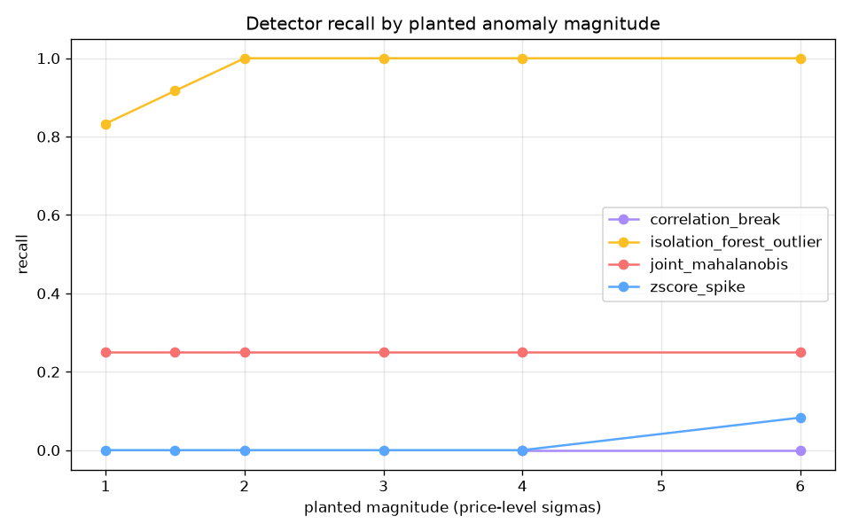

# Detector Quality Report (synthetic backtest)

Generated by `scripts/run_backtest_report.py` from the live
backtest harness (`src/backtest/harness.py`) — deterministic
synthetic scenarios, fixed seeds, no network. This report only
changes when detector code changes; regenerate it after any
detector modification.

## Scenario set

- Panel: 4 symbols x 500 hourly sections, deterministic random walk (^GSPC/^IXIC correlated at rho=0.9); first 150 sections are warm-up.
- Single-symbol plants: spike/dip/vol_burst via `inject.plant_anomalies` at [1.0, 1.5, 2.0, 3.0, 4.0, 6.0] price-level sigmas, 6 events per trial, 3 seeds, rotating target symbol.
- Joint-flip plants: the correlated pair shifted in OPPOSITE directions by [1.0, 1.5, 2.0, 3.0] return-sigmas simultaneously — per-asset moves far below single-asset thresholds; only the joint structure is anomalous.
- Clean replay: no plants, measures the false-positive rate.

## False-positive rate (clean replay)

Alerts per 1000 evaluated symbol-ticks with no anomalies present.

| detector | alerts/1000 ticks |
|---|---|
| correlation_break | 0.0 |
| isolation_forest_outlier | 100.0 |
| joint_mahalanobis | 0.0 |
| zscore_spike | 30.0 |

## Single-symbol planted anomalies

Pooled over all magnitudes and seeds. Precision = matched/alerts, recall = matched/planted, F1 = harmonic mean.

| detector | caught/planted | precision | recall | F1 | alerts fired |
|---|---|---|---|---|---|
| correlation_break | 0/8 | 0.00 | 0.00 | — | 31 |
| isolation_forest_outlier | 69/72 | 0.04 | 0.96 | 0.08 | 1739 |
| joint_mahalanobis | 11/44 | 0.52 | 0.25 | 0.34 | 21 |
| zscore_spike | 1/72 | 0.00 | 0.01 | 0.00 | 612 |

### Recall by planted magnitude (single-symbol)

| magnitude (level-sigmas) | correlation_break | isolation_forest_outlier | joint_mahalanobis | zscore_spike |
|---|---|---|---|---|
| 1.0 | — | 0.83 | 0.25 | 0.00 |
| 1.5 | — | 0.92 | 0.25 | 0.00 |
| 2.0 | — | 1.00 | 0.25 | 0.00 |
| 3.0 | — | 1.00 | 0.25 | 0.00 |
| 4.0 | 0.00 | 1.00 | 0.25 | 0.00 |
| 6.0 | 0.00 | 1.00 | 0.25 | 0.08 |

## Joint-flip planted anomalies (pair moves opposite)

Per-asset moves are sub-threshold by construction — only the joint structure is anomalous. This isolates what `joint_mahalanobis` adds over single-asset detectors.

| deviation (return-sigmas) | correlation_break | isolation_forest_outlier | joint_mahalanobis | zscore_spike |
|---|---|---|---|---|
| 1.0 | — | 0.20 | — | 0.00 |
| 1.5 | — | 0.20 | — | 0.00 |
| 2.0 | — | 0.20 | 0.60 | 0.00 |
| 3.0 | 0.00 | 0.20 | 0.60 | 0.00 |

## Pooled joint-flip metrics

| detector | caught/planted | precision | recall | F1 | alerts fired |
|---|---|---|---|---|---|
| correlation_break | 0/15 | 0.00 | 0.00 | — | 42 |
| isolation_forest_outlier | 12/60 | 0.01 | 0.20 | 0.02 | 1155 |
| joint_mahalanobis | 18/30 | 0.75 | 0.60 | 0.67 | 24 |
| zscore_spike | 0/60 | 0.00 | 0.00 | — | 369 |

## Reading this report

- A recall of 0 at low magnitudes is expected: no detector can catch a move smaller than its threshold.
- Isolation Forest carries a ~5% by-design flag rate (contamination=0.05), so its false-positive rate is structural, not a bug.
- The joint detector's value shows in the joint-flip table: single-asset recall stays ~0 at every deviation while `joint_mahalanobis` catches the pair move.

